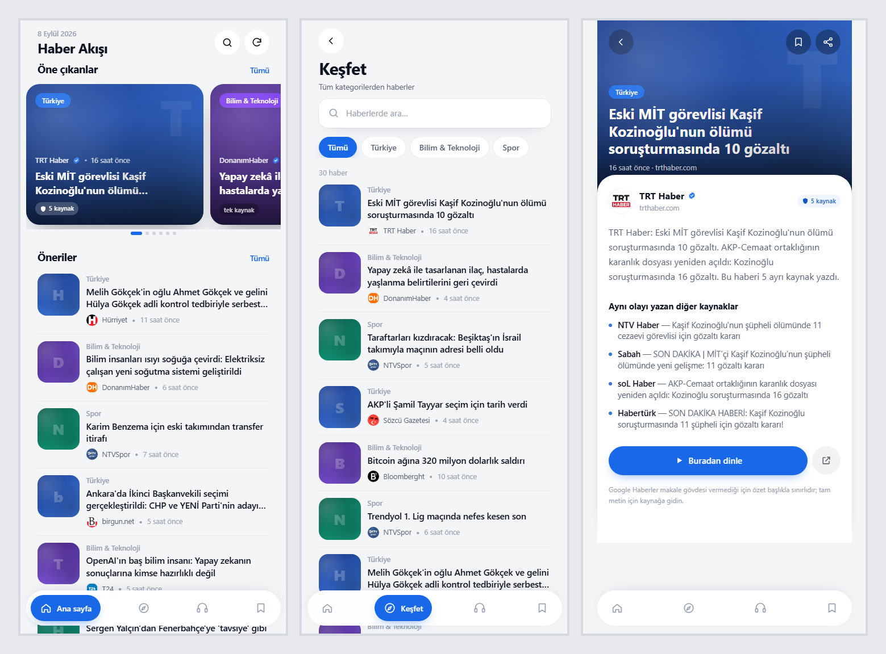

# Haber Akışı

Google Haberler RSS'inden her gün **30 haber** derleyip Tailwind tabanlı bir **PWA**'da sunan bülten.
İki kullanım biçimi var: kartlar arasında elle gezinme, ya da **hands-free** dinleme — okunan haber öne gelir, bitince sıradaki gelir.

Kategoriler: **Türkiye**, **Dünya**, **Ekonomi**, **Bilim & Teknoloji**, **Sağlık**, **Spor** — günde ~46 haber.

**Canlı:** https://arifw3.github.io/haber-akisi/ · **Depo:** https://github.com/arifw3/haber-akisi



## Hızlı başlangıç

Python 3.10+ yeterli, **pip bağımlılığı yok** (yalnızca standart kütüphane).

```bash
python -m mynews health     # 4 feed'in durumu
python -m mynews rank       # seçilen haberler + skor kırılımı
python -m mynews build      # site/data/latest.json üret

cd site && python -m http.server 8765
# http://127.0.0.1:8765
```

## Ekranlar

- **Ana sayfa** — öne çıkanlar yatay kart akışı (kategoriler harmanlanır, tek kategori kümelenmez) + öneriler listesi
- **Keşfet** — arama ve kategori filtreleri
- **Detay** — olayın özeti, *aynı olayı yazan diğer kaynaklar* listesi, dinleme ve kaynağa gitme
- **Kayıtlı** — sonra okumak için ayrılanlar (tarayıcıda saklanır)

Hands-free dinleme her ekranda çalışır; alt gezinmedeki kulaklık düğmesi bülteni baştan okur,
mini oynatıcı sırayı ve kontrolleri gösterir. `?v=discover`, `?id=<haber>` ve `?autoplay=1`
derin bağlantıları desteklenir.

## Nasıl çalışıyor?

### Önem sinyali: kaç kaynak yazdı

Google Haberler RSS'inde her öğenin `<description>` alanı, aynı olayın farklı yayıncılardaki
hallerini `<ol><li>` listesi olarak veriyor. Bu liste doğrudan bir önem sinyali:

```
Gökçek'in oğlu adli kontrolle serbest bırakıldı      → 5 kaynak
"Yapay zeka akım başlattı: Ünlü isimler ışınlandı"   → 1 kaynak
```

Gerçek gündem maddeleri 4-5 kaynakta çıkıyor, tıklama tuzağı tek kaynakta kalıyor.
Skor şöyle: `log2(1+kaynak) × w1 + tazelik × w2 + yayıncı güveni × w3 − clickbait cezası`

### Filtreler

- **Format elemesi** — "Canlı Anlatım", "Puan Durumu", "Hangi kanalda", burç/hava durumu…
- **Clickbait cezası** — "flaş", "şok", "sayılı gün kaldı", ünlem yoğunluğu, tamamı büyük harf
- **Yayıncı güveni** — `config/settings.json` içinde kaynak bazlı ağırlık
- **Tekrar elemesi** — benzer başlıklar (Jaccard) tek habere iner; yayıncı başına en fazla 3 haber

**Segment bazlı ayar:** Google, Bilim ve Teknoloji feed'lerinde kümeleme yapmıyor — orada her haber
tek kaynak görünüyor, yani ana sinyal çalışmıyor. Bu yüzden o segmentte yayıncı güveni ve clickbait
cezası ağırlıklandırılıyor (`scoring_override`), ayrıca `min_trust` eşiği içerik çiftliklerini eliyor.

### Ses

Öncelik sırası:

1. **Hazır ses dosyası** — `python -m mynews build --with-audio` ile üretilmişse (haber başına bir dosya)
2. **Tarayıcının Türkçe sesi** — Web Speech API; anahtar gerekmez, varsayılan olarak bu çalışır

İki TTS motoru destekleniyor, anahtarı tanımlı olan seçilir:

| Motor | Ortam değişkeni | Notlar |
|---|---|---|
| **Google Cloud TTS** | `GOOGLE_TTS_API_KEY` | Türkçe **anadil** sesleri (`tr-TR-Wavenet`), aylık 1M karakter ücretsiz katmanda — otomatik seçimde önce bu denenir |
| ElevenLabs | `ELEVENLABS_API_KEY` | `POST /v1/text-to-speech/{voice_id}`; Free planda yalnızca İngilizce anadilli sesler |
| Gemini | `GEMINI_API_KEY` | `gemini-2.5-flash-preview-tts` |

Aynı metin ikinci kez faturalanmasın diye **içerik adresli önbellek** var: metin + motor + model +
ses birleşiminin hash'i dosya adı olur (`site/audio/cache/<hash>.mp3`). Gündemde kalan haber ertesi
gün, aynı gün ikinci build ise ücret yaratmaz; workflow önbelleği `actions/cache` ile taşır.
Ziyaretçi sayısı maliyeti zaten etkilemez — ses günde bir kez üretilip herkese aynı dosya sunulur.

Bülteni tek uzun MP3'te birleştirmek yerine **haber başına bir dosya** üretiliyor. Böylece ffmpeg
bağımlılığı, zaman damgası senkronu ve uzun üretimde kalite kaybı sorunlarının üçü de ortadan kalkıyor.

**Türkçe doğallık.** TTS ne verirsen onu okur; haber başlıkları yazılı dil için yazılmış.
`mynews/speech.py` metni sese hazırlar: `AKP` → "A Ka Pe" (ama `MASAK` kelime gibi okunur),
`Bakan Tekin:` → `Bakan Tekin,` (iki nokta duraklama yaratmıyor, cümleler birbirine giriyordu),
tırnaklar atılır ama `Ankara'da`'daki apostrof korunur, `birgun.net` → `birgun`, `(ÖZET)` gibi
editoryal etiketler silinir. Bilinmeyen kısaltmaya dokunulmaz — yanlış okumak, bozmaktan iyidir.

Bu metin katmanıdır ve etkisi büyüktür; ama sesin **anadili** ayrı bir mesele. ElevenLabs'in Free
planı Voice Library'yi API'ye kapatıyor, dolayısıyla yalnızca İngilizce anadilli varsayılan sesler
(Sarah, Brian, Bill, Callum, Alice) kullanılabiliyor ve Türkçe'de hafif aksan kalıyor. Türkçe
anadilli ses için ücretli plan gerekir; alternatif olarak Google Cloud TTS (`tr-TR-Wavenet`) ve
Azure (`tr-TR-EmelNeural`) Türkçe'de belirgin biçimde daha doğaldır.

**Karakter kotası gerçeği:** 30 haber ≈ 4.600 karakter/gün, yani ayda ~138.000. ElevenLabs'in
Creator planı (100k) bile tamamına yetmiyor. Bu yüzden `tts.limit` ayarı var: yalnızca en yüksek
skorlu N habere ses üretilir, kalanı arayüzde tarayıcı sesiyle okunur. Varsayılan 3 (≈26k/ay).

## NotebookLM bağlantısı

NotebookLM, Google Docs kaynaklarını **otomatik senkronluyor** (Mayıs 2026'dan beri); web
linkleri ve PDF'ler senkronlanmıyor. Bu yüzden bülten her sabah aynı Doc'a yazılıyor —
notebook güncel içeriği kendiliğinden görüyor.

```bash
python -m mynews build --sync-doc
```

Ayrıca tarayıcısız okuyucular için düz sürümler üretiliyor (PWA JavaScript ile çalıştığı için
crawler'lar ana sayfada içerik göremez):

- `bulten.txt` — düz metin
- `bulten.html` — JS'siz HTML

Bu adım **günlük çalışmanın parçası değildir** — NotebookLM'i kullanmak istediğinde elle
çalıştırılır. Böylece projenin geri kalanı bağımlılıksız kalır.

**Kurulum** (tek seferlik): Google Cloud'da servis hesabı → Google Docs API'yi etkinleştir →
JSON anahtarı indir → hedef Doc'u servis hesabının e-postasıyla **Düzenleyen** olarak paylaş.
Sonra iki secret: `GOOGLE_DOC_ID` (Doc URL'indeki uzun dizge) ve `GOOGLE_SERVICE_ACCOUNT_JSON`
(anahtar dosyasının tamamı).

`requirements.txt` projenin **tek** pip bağımlılığıdır ve yalnızca bu özellik için gerekir:
servis hesabı JWT'si RS256 ile imzalanmalı, standart kütüphanede RSA imzalama yok. `--sync-doc`
kullanılmadığında `mynews/gdocs.py` hiç içe aktarılmaz.

## Podcast

Her sabah iki sunuculu (Ayşe & Mert) bir bölüm üretilir:

1. `script.py` Gemini ile senaryoyu yazar — yalnızca yayıncı özetlerinden, uydurma denetimiyle
2. Replikler ayrı ayrı seslendirilir (arayüz sırayla çalar, önbellek replik bazında çalışır)
3. `podcast.py` replikleri tek dosyada birleştirir ve iTunes uyumlu RSS yazar

**https://arifw3.github.io/haber-akisi/podcast.xml** — Spotify, Apple Podcasts veya herhangi bir
uygulamaya eklenebilir. Birleştirme için ffmpeg gerekmez: aynı kodekle üretilmiş MP3 çerçeveleri
arka arkaya eklenince geçerli dosya oluşur, süre MP3 başlığındaki bit hızından hesaplanır.

Gemini zaman zaman 503 döndüğü için istekler artan beklemeyle yeniden denenir; tek denemede
vazgeçmek günlük bölümün hiç üretilmemesi demek olurdu.

## Günler arası tekrar elemesi

Gündemde birkaç gün kalan haber her sabah yeniden sunuluyordu. `history.py` son 7 günde
gösterilen haberleri hatırlar ve benzerlerini eler. Başlık belirgin değiştiyse (yeni gelişme)
benzerlik düşeceği için haber tekrar geçer — istenen davranış budur.

Bugünün kayıtları "görülmüş" sayılmaz; aksi halde aynı gün ikinci kez üretim yapıldığında
bülten boşalırdı. Geçmiş, iş akışında `actions/cache` ile taşınır.

## Sağlık denetimi

Sistem sessizce bozulabilir: Google bir feed'i değiştirse, Gemini kotası dolsa, TTS anahtarı
sussa — her adım hatayı zarifçe yutar ve iş akışı yeşil kalır. `doctor` bunu engeller:

```bash
python -m mynews doctor                                      # yerel bülten
python -m mynews doctor --url https://arifw3.github.io/haber-akisi   # yayındaki
```

Haber sayısı, bülten tazeliği, feed durumu, seslendirme oranı, yayıncı eşleşme oranı ve podcast
bölümü kontrol edilir; eşikler `config/settings.json` → `thresholds` altında.

**Denetim dağıtımdan sonra ve ayrı bir işte çalışır.** Podcast üretilemedi diye sitenin hiç
güncellenmemesi, eksik podcast'ten daha kötü olurdu — önce yayınla, sonra uyar. Build içindeki
denetim yalnızca rapor amaçlıdır (`continue-on-error`).

Kullanıcı tarafında da bir güvenlik ağı var: bülten 36 saatten eskiyse arayüzde uyarı görünür.

## Çevrimdışı dinleme

Service worker sesleri ayrı ve sürümsüz bir önbellekte tutar (`mynews-audio`) — bülten
güncellense de indirilmiş sesler durur; dosya adları içerik hash'i olduğu için tazeleme derdi yok.
Ana sayfadaki **"Çevrimdışı dinlemek için kaydet"** düğmesi günün tüm seslerini (haberler +
podcast) tek seferde indirir, ilerlemeyi gösterir. Sabah wifi'dayken kaydet, yolda dinle.

## Bilinçli sınırlar

Google Haberler RSS'inin verdikleri ve vermedikleri araştırmayla doğrulandı:

| Var | Yok |
|---|---|
| Başlık | **Makale gövdesi** — `description` yalnızca ilgili haber listesi |
| Yayıncı adı ve alan adı (`<source url>`) | **Görsel** — `media:content`/`enclosure`/`thumbnail` hiçbiri yok |
| Yayın zamanı | **Yayıncıya doğrudan link** — bkz. aşağıda |
| Aynı olayın diğer kaynaklardaki başlıkları | |

**Linkler `CBMi…` biçiminde kodlu ve sunucu tarafında çözülemiyor.** Makale sayfası tam Chrome
User-Agent'ıyla çekildiğinde 592 KB HTML dönüyor ve içinde tek bir yayıncı URL'si bulunmuyor
(yalnızca `angular.dev/license`); yönlendirmeyi tarayıcıda JS yapıyor. Bu yüzden kartlardaki bağlantı
Google Haberler bağlantısıdır — tarayıcıda tıklanınca yayıncıya gider.

**Seslendirme başlıkla sınırlı.** Gövde metni olmadığı için LLM'e serbest metin yazdırmıyoruz;
`speech` alanı yalnızca başlık, yayıncı adı ve kaç kaynağın yazdığından oluşuyor. Uydurma riski
böylece tasarımdan kaldırılmış oluyor.

### Görsel ve doğrudan bağlantı: yayıncı feed'inden

Google Haberler görsel de vermiyor, yayıncıya doğrudan link de. Ama yayıncının **adı ve alan adı**
elimizde (`<source url>`). Yayıncının kendi RSS'i çekilip başlıklar eşleştirilince ikisi de geliyor:

```
python -m mynews build
eslestirme: {'aranan': 26, 'eslesen': 11, 'gorselli': 9}
```

Kapsam kısmidir ve öyle olması normaldir — her yayıncının feed'i yok, bazıları görsel taşımıyor,
haber feed'den düşmüş olabilir. Eşleşme bulunamayan haber kategori gradientiyle gösterilir.
Benzerlik eşiği (`image_matching.similarity`, varsayılan 0.5) bilinçli olarak yüksek: **yanlış
eşleşme, habere ait olmayan bir fotoğraf göstermek demek.** Aynı sebeple stok görsel de kullanılmıyor.

Yayıncı feed listesi `config/settings.json` → `publisher_feeds` altında; yeni yayıncı eklemek
bir satırlık iş.

## Yayına alma (GitHub Pages)

`.github/workflows/daily.yml` her gün 06:00'da (TR) çalışır: feed sağlığını kontrol eder, bülteni
üretir, testleri koşar ve Pages'e dağıtır. Bülten doğrudan Pages çıktısına girer, depoya işlenmez.

Depo kuruludur; **Settings → Pages → Source** `GitHub Actions` olarak ayarlıdır.
`main` dalına her push ve her sabahki cron çalışması yayını tazeler.
Ses üretimi istiyorsanız `ELEVENLABS_API_KEY` veya `GEMINI_API_KEY` değerini
**Settings → Secrets and variables → Actions** altına ekleyin ve workflow'daki build adımını
`python -m mynews build --with-audio` yapın.

## Yapı

```
mynews/
├── gnews.py      Google News RSS çekme + ayrıştırma (source url, ilgili haberler)
├── rank.py       filtreler + skorlama + segment bazlı ağırlıklar
├── build.py      bülten JSON'u ve seslendirme metni
├── tts.py        ElevenLabs / Gemini, haber başına ses
└── cli.py        health | rank | build

site/             PWA — Tailwind (CDN), vanilla JS, service worker
├── index.html    kabuk
├── app.js        deste, hands-free oynatıcı, arama, kaydedilenler
├── sw.js         kabuk cache-first, veri network-first
└── data/         latest.json + günlük arşiv

config/settings.json   kategoriler, kotalar, ağırlıklar, yayıncı güveni, filtreler
tests/                 22 birim testi (ağ erişimsiz)
```

## Testler

```bash
python -m unittest discover -s tests -v
```

Kapsam: başlık/yayıncı ayrıştırma, ilgili haber listesi, Türkçe normalizasyon (`İ`/`I` tuzağı dahil),
benzerlik, format elemesi, clickbait cezası, yayıncı kotası, tekrar elemesi, seslendirme metni.

## PWA notları

- Telefonda **Ana ekrana ekle** ile kurulur; ikon, tam ekran ve çevrimdışı açılış çalışır.
- Service worker kabuğu cache-first, bülten verisini network-first tutar — internet yoksa son bülten görünür.
- Hands-free sırasında ekranın kapanmaması için Wake Lock istenir.
- Tailwind CDN'den geliyor; ilk açılışta internet gerekir, sonrasında cache'ten gelir.
